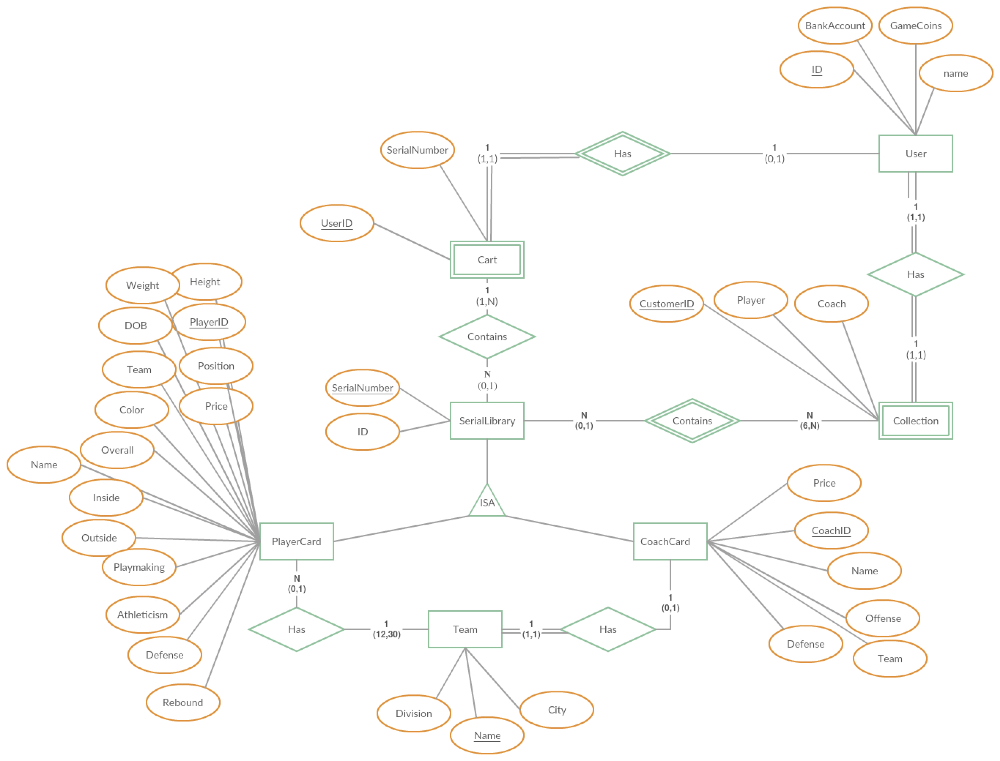

# NBA Player Database
Project Team Member: Yiming Yang, Tiecheng Su, Yiming Pan, Yadong Wei
## Description
Create interface that allows users to customize basketball teams from stored players’ data adapted from National Basketball Association. Interface allows users to register account, search desired players by entering criteria, manage team line up and game coins by buying and trading players. Users’ information, owned players’ collection, shopping details are managed through MySQL server.

## ER Diagram:

## Sample Screenshots:

